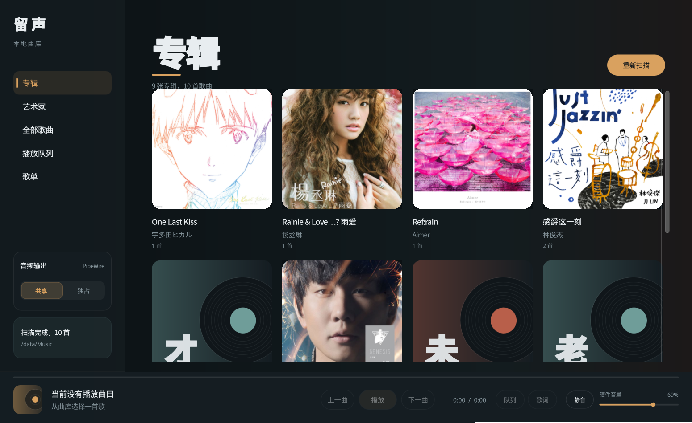

# Liusheng 留声

Linux 与 macOS 本地音乐播放器。Linux 版提供 PipeWire 共享输出和 ALSA 独占输出，macOS 版使用 CoreAudio 共享输出。

技术结构：`liusheng-core` 是无 UI 依赖的 Rust 核心（解码、播放引擎、曲库），前端用 Qt Quick/QML，经 cxx-qt 桥接。设计决策全文见 [DECISIONS.md](DECISIONS.md)。



## 构建

```sh
just build     # 构建
just test      # 测试
just run       # 启动桌面应用
just install   # 构建 release 并安装到 ~/.local
just uninstall # 卸载程序，保留曲库数据
just alsa-probe # 用静音验证 AKG N9 的原生格式与重采样
just output-smoke # 验证共享、独占、共享输出切换
just volume-probe # 验证 AKG N9 的硬件音量与静音开关
just package-deb # 生成 amd64 DEB
just package-rpm # 生成 x86_64 RPM
just package-arch # 生成 x86_64 Arch Linux 包
just package-macos # 生成当前 Mac 架构的应用包
```

安装脚本支持 `PREFIX` 和 `DESTDIR`。打包测试示例：

```sh
PREFIX=/usr DESTDIR=/tmp/liusheng-package just install
```

Linux 版从 `/data/Music` 扫描音乐。Fedora 构建依赖：

```sh
sudo dnf install qt6-qtbase-devel qt6-qtdeclarative-devel clang pipewire-devel alsa-lib-devel just flac
```

macOS 版从 `~/Music` 扫描音乐。安装 Qt 后可直接构建应用包：

```sh
brew install qt
just package-macos
```

## 发布

`scripts/package.sh` 将安装文件放入系统标准路径，并把安装包写入 `dist/`：

```sh
./scripts/package.sh deb
./scripts/package.sh rpm
./scripts/package.sh arch
./scripts/package-macos.sh
```

DEB 以 Debian 13 为运行基线，RPM 以 Fedora 44 为运行基线。Arch 包需要在 Arch Linux 普通用户环境中运行 `makepkg`。macOS ZIP 包经过临时签名，首次运行时需在 Finder 中右键选择“打开”。

推送 `vX.Y.Z` 标签后，GitHub Actions 会生成 DEB、RPM、Arch x86_64、macOS arm64 和 macOS x86_64 产物，并发布 SHA-256 校验文件。标签版本必须与 `crates/liusheng/Cargo.toml` 一致。

## 状态

第一阶段（MVP）功能已贯通。Rust 核心具备解码、播放、曲库增量扫描、目录变更监听与拼音搜索。Qt/QML 桌面应用支持专辑、艺术家、全部歌曲和播放队列浏览，支持搜索、播放控制、歌词、封面和系统托盘。Linux 版提供 PipeWire 共享输出、MPRIS、ALSA 独占输出和 AKG N9 硬件音量控制。macOS 版提供 CoreAudio 共享输出，界面会隐藏 Linux 专属控件。

独占模式使用 Rubato 将 44.1 kHz 连续重采样到 96 kHz、24 位，48/96 kHz 内容保持整数路径。专辑封面优先读取音频内嵌图片，回退到同目录的 `cover`、`folder`、`front` 图片。当前源码未授予开源许可证，权利保留。
