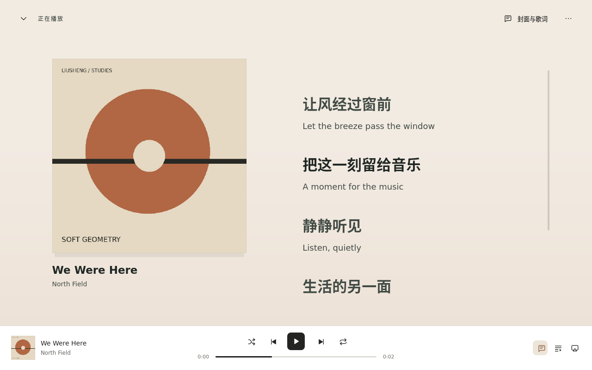
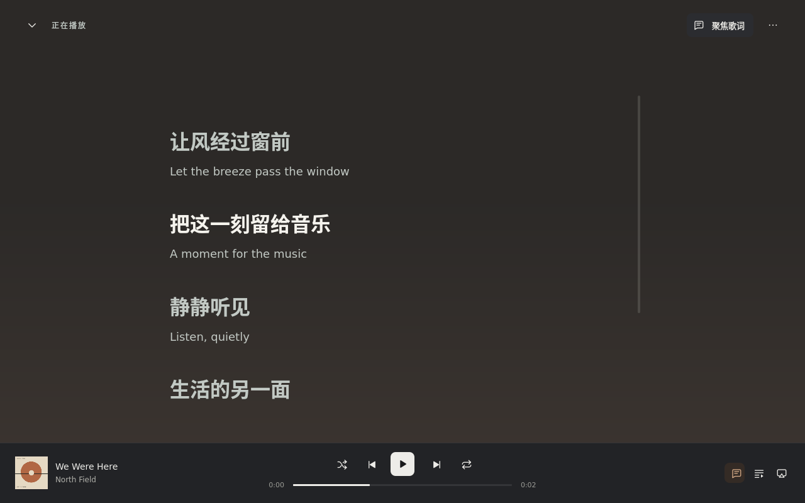

# 聆听页与 macOS 系统媒体控制

## 本轮范围

围绕封面语义配色、歌词阅读和封面展开转场更新“正在播放”，并增加 macOS MediaPlayer 适配器。曲库、队列和输出引擎继续使用既有接口。品牌图标、托盘字形、占位封面和封面缓存格式保持原样。

设计吸收了 Folia 的内容优先、主题角色和稳定控制外壳思路，界面与实现由本项目独立编写。主播放器继续常驻，曲库浏览保持原来的高密度列表与网格。

## 播放页

`ListeningPalette.qml` 从现有封面强调色派生背景、表面、正文、辅助文字、强调色及分割线。颜色受到亮度与混合比例约束：正文和辅助文字在背景、渐变末端及面板表面分别进行对比度测试。无封面时使用稳定的中性配色；切歌时重置缺失的旧强调色。

布局提供“封面与歌词”“聚焦歌词”“纯封面”。宽窗口使用左右两栏；窄窗口在封面和歌词之间切换，标题允许两行，歌词使用稳定字号与行高。控制条、输出弹层和播放队列继续使用原来的操作语义。

`AmbientBackdrop.qml` 使用普通 Qt Quick 几何渐变。背景漂移最多每 100ms 更新一次，且仅在播放、聆听页显示、窗口处于活动状态时运行。暂停、隐藏、切换页面和减少动画均停止漂移。色彩变化使用短暂过渡，明暗模式切换保持文字与背景同步。系统图形驱动与物理 GPU 表现需要实机验收。

## 歌词数据与交互

原始 `LyricLine` 和播放时间轴保留；`Lyrics::display_cues()` 将同一精确时间戳的多个真实文本组合为一个显示单元。首条非空文本作为主行，其他文本作为附文，重复文本去重。歌词源提供原文与译文时即可上下显示；来源只有行级时间时继续使用行级同步。

显式空歌词表示间奏，第一句之前显示前奏。正偏移可以延迟零时间戳的第一句；跳转时使用时间戳加偏移并约束为有效播放位置。原文与附文均作为纯文本渲染，支持中文、日文、英文换行。无时间歌词提供阅读，点击保持播放位置。

显示单元在后台读取线程中序列化，UI 按数据变化接收一次；连续播放仅通过二分查找当前显示单元。歌词列表虚拟化，自动滚动与手动阅读分开：手动浏览暂停跟随，“回到当前句”恢复；明确的播放定位和歌曲变化重新校准。旧异步歌词请求通过代际序号丢弃，涵盖同一文件的快速重新加载。

设置新增 `cover_theme`、`ambient_motion`、`lyric_secondary`，通过已有 serde 默认值兼容旧设置；原有减少动画总开关继续生效。

## 连续转场与 Wayland

`CoverFlight.qml` 在主窗口内复用一张封面呈现图，通过 `mapToItem` 计算底部小封面与聆听页封面的位置关系，260ms 同步位置与尺寸。快速反向操作从当前过渡位置继续；窗口尺寸变化、来源变化、隐藏或减少动画会停止过渡。

全部菜单维持 `Popup.Item`，布局菜单与歌词选项使用现有窗口边界约束。原生文件选择器沿用已明确的父窗口；托盘继续使用原有 Wayland 兼容处理。本轮保留键盘返回、下拉菜单先处理 Esc、播放器与窗口焦点恢复的验收。

## macOS 系统集成

平台实现使用公开的 `MPNowPlayingInfoCenter` 与 `MPRemoteCommandCenter`。GUI 控制器继续发布共同的 `PlaybackSnapshot`；Linux 使用原来的 MPRIS，macOS 使用 `macos_media.rs` 与一个小型 Objective-C++ 适配器。

系统信息包含歌曲、艺术家、专辑、本地封面、时长、位置、播放速率和队列位置。播放/暂停会同步更新 macOS 的 `playbackState` 与信息字典。普通进度约每五秒校准，状态、元数据、封面及定位变化即时更新；系统利用速率推进两个更新之间的位置。

支持播放、暂停、切换播放、上一首、下一首、停止、进度定位、前后跳转和循环/随机模式命令。回调验证范围后只向 Rust 通道投递命令，再由原有 Qt 控制器处理。界面和系统媒体控制共用一条播放控制路径。

恢复的暂停队列保持安静；第一次实际播放后发布 Now Playing 信息，暂停后保留控制能力。队列清空、停止和退出时清理元数据。退出移除本适配器注册的目标，避免重复回调；异步封面处理使用代际序号，旧任务无法覆盖新曲目或已清理状态。

封面仅接受本地 file URL，读取前限制文件大小，ImageIO 在后台生成最大 768px 缩略图。系统元数据的内容标识使用路径的哈希值。实现沿用系统提供的媒体按键分发，未增加全局键盘事件拦截。

公开 API 参考：
- https://developer.apple.com/documentation/mediaplayer/mpnowplayinginfocenter
- https://developer.apple.com/documentation/mediaplayer/mpnowplayinginfocenter/playbackstate
- https://developer.apple.com/documentation/mediaplayer/mpremotecommandcenter
- https://developer.apple.com/documentation/mediaplayer/mpnowplayinginfopropertyelapsedplaybacktime

## 验证入口

```sh
cargo test --workspace --features liusheng-core/coreaudio-compile-check --locked
just ui-controls-test
just ui-test
just wayland-test
```

Apple Silicon 原生测试：

```sh
just macos-media-test
```

原生测试在独立 AppKit 测试包中编译生产适配器，使用真实 MediaPlayer 对象检查元数据、播放状态、11 个注册目标、命令边界、封面加载与竞态、停止清理和重新注册。命令回调投递到测试接收器；真实耳机按键和控制中心按钮需要进一步的用户桌面验收。失败日志会直接显示，并归档到 CI 诊断目录。

macOS arm64 普通 CI 与发布均在完整 Qt 构建前执行该测试。发布目标仍为 DEB、RPM、AppImage 和 macOS arm64。本轮不创建发布标签。

本地 QA 输出在 `target/qa/listening-upgrade/`。Linux 的原生 Wayland 回归使用独立 Weston 软件合成器和合成 Qt 输入，覆盖 100%、125%、150% 缩放；实际 KDE、输入法、GPU、多显示器及硬件媒体按键继续按下节验收。Apple 目标 Rust 交叉类型检查验证 Rust 侧平台代码，完整 Objective-C++ 链接和 MediaPlayer 运行以原生 macOS CI 为准。

## 桌面验收

Fedora：打开曲目后进入聆听页，切换三种布局、打开并关闭菜单、调整窗口与桌面缩放；快速展开/收起后确认封面位置、键盘焦点和歌词跟随，暂停及切回曲库后确认背景停止。按原流程验证 PipeWire 共享与 ALSA 独占。

macOS arm64：使用打包后的 `Liusheng.app` 开始播放，查看控制中心的歌曲、封面和进度；从系统执行暂停、继续、上一首/下一首和定位，再验证耳机按键。隐藏窗口后继续控制，退出后确认系统信息清理；恢复暂停队列时确认其他播放器的系统控制保持原有归属。实际系统可见按钮由 macOS 决定。

## 本地验收记录

135 项 Rust 测试、65 项 Python 测试、35 项 Qt Quick 控件用例通过。实际 release 执行 58 个页面/弹层步骤，并通过功能、队列恢复、单实例与 MPRIS 回归。Weston Wayland 的 100% / 125% / 150% 三档均通过；新增布局菜单保持窗口内绘制。文件选择器退出后再进入聆听页的焦点恢复也纳入回归。

已生成包含本轮修改的 AppImage，通过打包完整性、迁移到含空格路径、ALSA 配置、程序启动和完整 UI 功能回归。Apple Silicon Rust 适配器完成实际目标类型检查和严格 Clippy；Objective-C++ 与 MediaPlayer 的原生结果由新增 macOS arm64 CI 验证，本地 Linux 未执行这些原生测试。

以下为生成的虚构音乐集合在实际程序中的截图：




